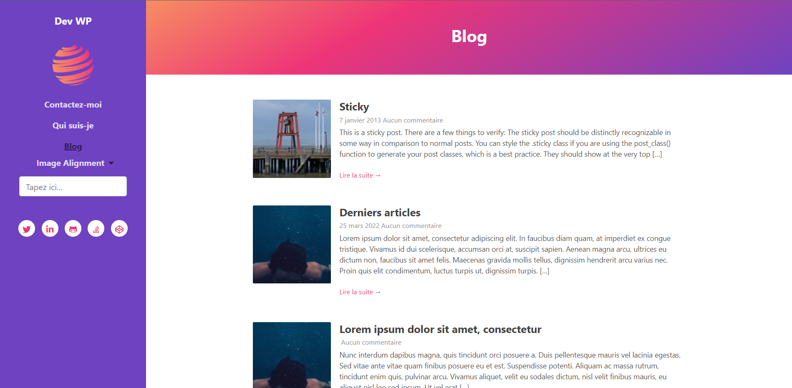

# tensixtwentytwentytwo

TenSixTwentyTwentyTwo est un thème de blog modern. Il supporte l'éditeur Gutenberg. Il a un look simple, une présentation fluide, et parfaitement adapté aux blogs personnels. TenSixTwentyTwentyTwo est totalement contrôlé et accessible depuis l’affichage du personnalisateur. Il est très simple et intuitif que même un utilisateur novice puisse utiliser ce thème. Pourtant de nombreuses fonctionnalités haut de gamme ont été fournies gratuitement afin que toutes les fonctionnalités de base et avancées puissent être utilisées. En l'ocurence l'éditeur de page Visual Composer afin que chacun peut personnaliser ses pages et articles selon leurs besoins.

# Tags: 
Blog, Gutenberg, Sidebar, Visual Composeur, Minimal, Simple, Modern, Cool

